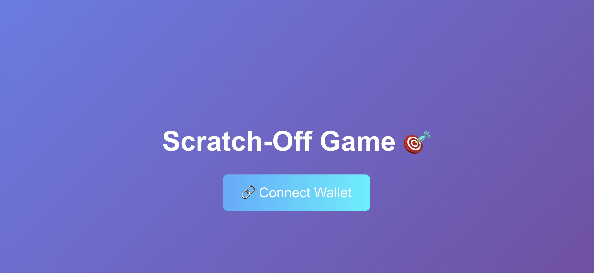
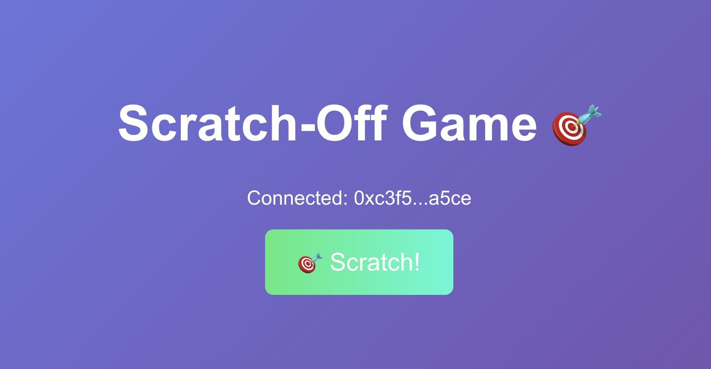
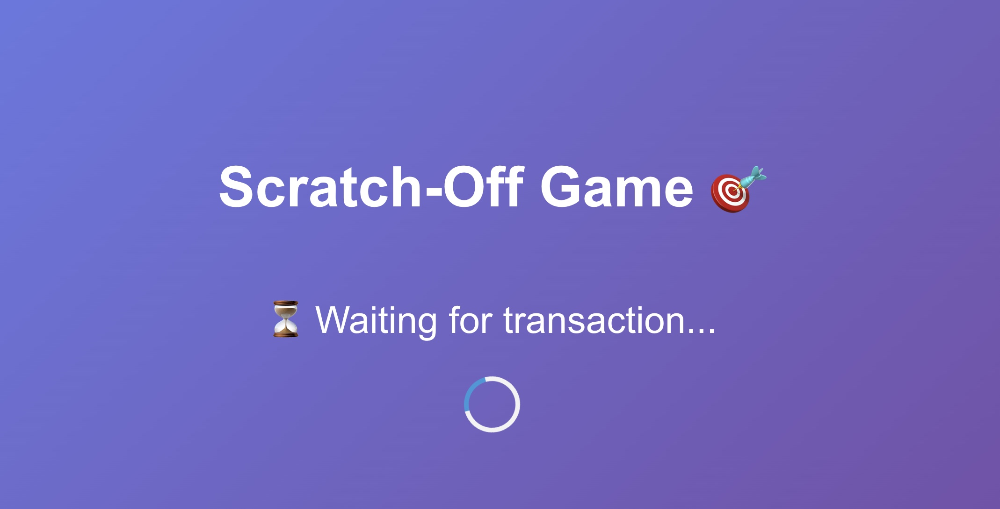
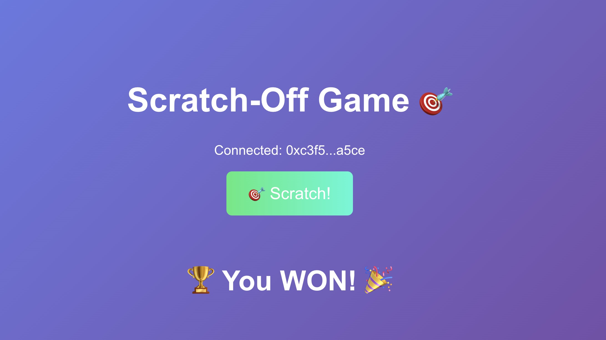
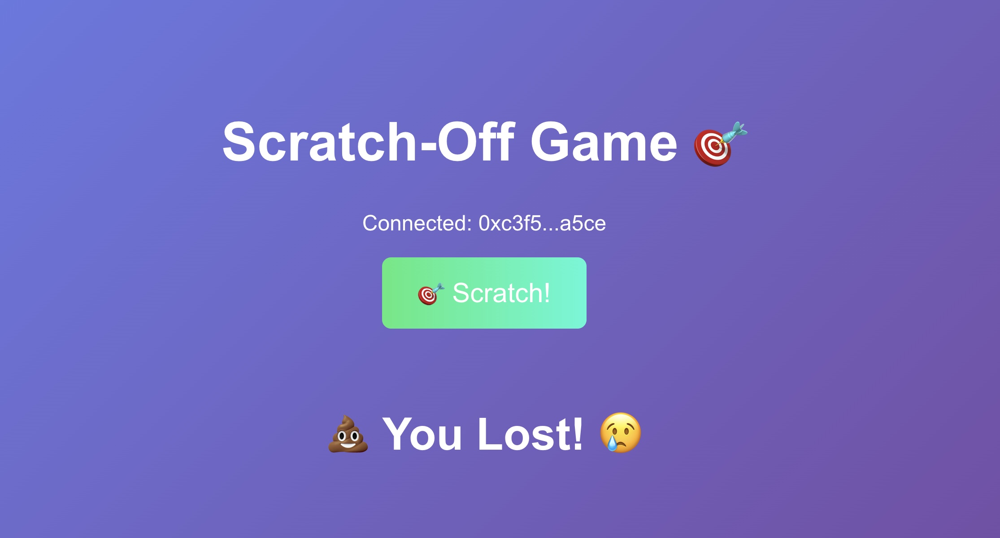
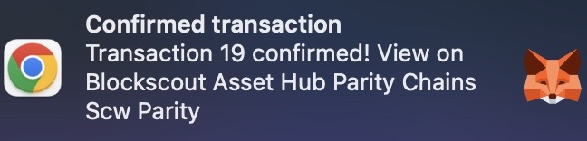

Summary
-----------
A scratch-off lottery dApp built on Polkadot AssetHub EVM, letting users interact with blockchain smart contracts for instant win/loss games

Links
------
LINK TO DEMO: https://drive.google.com/file/d/15uWW7Wx6fwnpbD_LgzsKdf0HLDkPodAC/view?usp=sharing

LINK TO VIDEO PROJECT EXPLANATION:
https://www.loom.com/share/3e43bae887784165af6ca4b68afd60b7?sid=1d97b085-7385-47e1-b62c-1ca878178548

BLOCK EXPLORER LINK:
https://blockexplorer.one/binance-smart-chain/testnet/address/0xd35eae619F2514f454fc3b832C3Aa85e884B7c15

Full Description
-----------------
This project solves the need for lightweight blockchain gaming apps by providing a simple, instant scratch-off lottery experience. Users interact with a deployed smart contract on Polkadot’s AssetHub EVM, ensuring decentralized verification of game outcomes. Scratch results are recorded immutably on-chain, showcasing the transparency and trustless environment Polkadot enables

SDKs and technicals
-------------------
The dApp was built using React.js for the frontend and Solidity for the smart contract. It uses ethers.js to connect the frontend to the deployed contract. The Polkadot AssetHub EVM environment was essential to deploy an EVM-compatible smart contract without leaving the Polkadot ecosystem. Features like low transaction costs, fast block finalization, and Substrate’s EVM compatibility allowed quick development and real blockchain interactions. MetaMask was used for wallet connection, ensuring easy access for users

## Technical Summary

| Category | Details |
|:---|:---|
| **Frontend** | React.js |
| **Smart Contract** | Solidity 0.8.x |
| **Blockchain Connection** | ethers.js v6 |
| **Wallet Integration** | MetaMask |
| **Deployment** | Polkadot AssetHub Westend Testnet (EVM parachain) |
| **Block Explorer** | Blockscout for AssetHub Westend |

---

##  Unique Polkadot Features Leveraged

- Substrate-based EVM compatibility
- Ultra-low transaction fees on Westend testnet
- Rapid block finality for quick scratch confirmations
- AssetHub’s EVM environment allowed seamless Ethereum-style deployment

## Smart Contract Overview

The ScratchOff smart contract provides a simple win/lose lottery experience fully on-chain.

- Users call the `scratch()` function to generate a random result.
- Randomness is based on the current block timestamp, block number, and sender address.
- A boolean result (`true` for win, `false` for loss) is stored in a mapping linked to the player's address.
- The `checkResult(address)` function allows anyone to view whether a given player won or lost.
- All game outcomes are immutably recorded on the blockchain, ensuring transparency and fairness.

UI Screenshots
------------------

